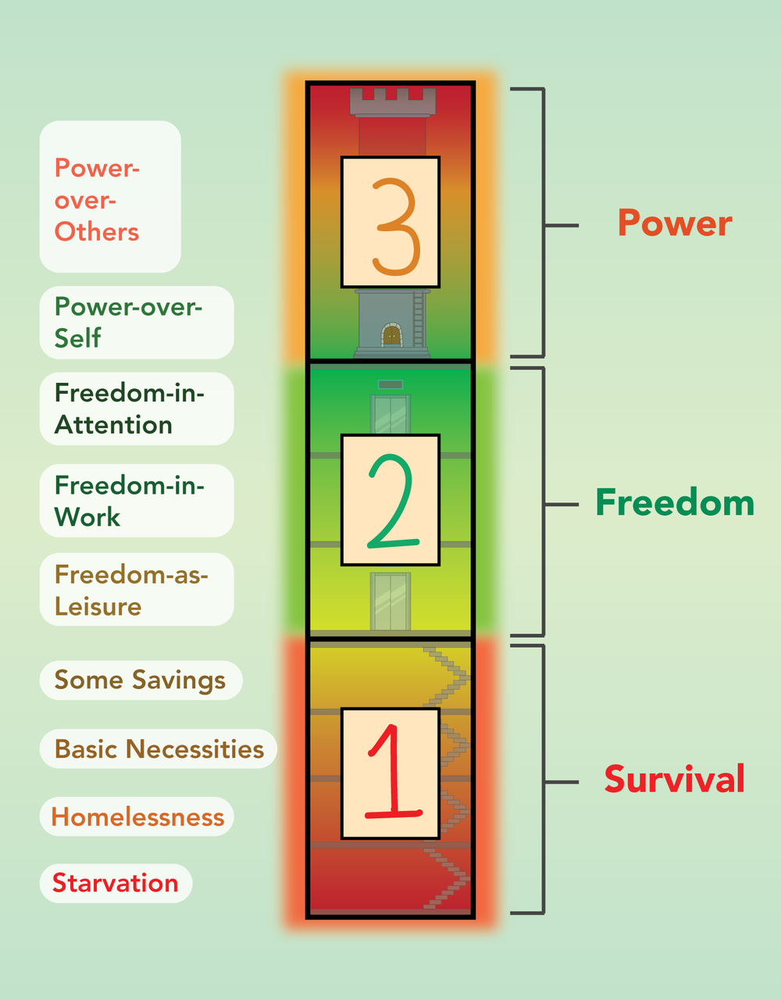
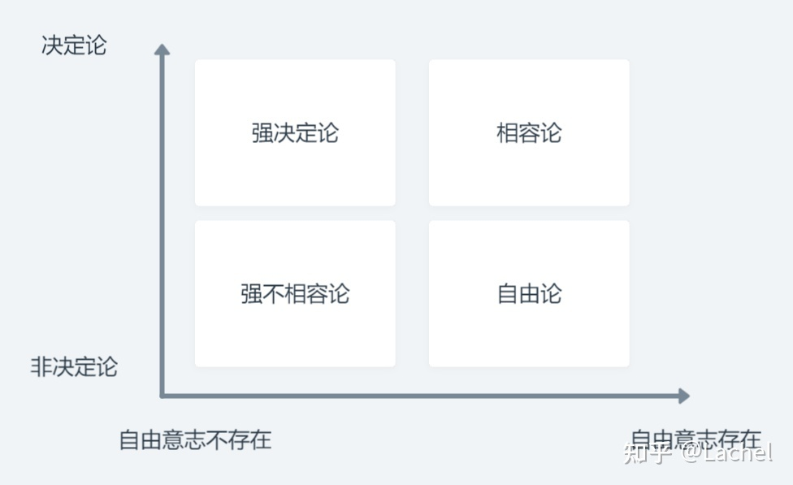

- #每日阅读 [一篇文章说清楚我们和金钱的关系](https://youzhiyouxing.cn/n/materials/875)
	- 金钱光谱：Survival 生存 - Freedom 自由 - Power 权力
		- {:width 400}
		- 生存阶段：Starvation  ,  Homelessness , Basic Necessities , Some Savings
			- 在前三个阶段，生存是现实带来的，最后一个阶段，生存是心态影响的
			- 你越是把钱看作生存必备的手段，你就越不愿意为了实现更充实的生活而冒险
			- 这个阶段的特点：恐惧不确定性
			- 摆脱生存模式的关键是意识到你拥有的已经「足够多」，这个词对不同的人来说，有着不同的含义，这里指的是：你已经满足了基本的生活所需
			- 一旦你意识到钱是你拥有的资源——而不是相反——你就会看到钱的真实面目：它是一个放大你自己信仰的工具
		- 自由阶段：Freedom-as-Leisure , Freedom-in-Work , Freedom-in-Attention
			- 钱成为一种运转机制，而不是最终结果，在这个阶段，钱才能体现出真正的价值
			- 金钱是实现自由的工具
			- 自由最常见的表现形式之一是享受闲暇，即 Freedom-as-Leisure 阶段
			- Freedom-in-Work 更进一步，享受闲暇的同时，可以享受自己的工作，而不是痛苦的利用更多的工作时间换来更短的闲暇。在「工作自由」的模式中，只要钱足以维持生活、让你继续做想做的事情即可
			- 不要让钱这种轻易就能被取代的东西定义你独特的身份。相反，你应该利用它，让真正属于自己的特质得以发展
			- 成就感盈余
			- 注意力自由：和财务自由最相关的其实不是钱，而是注意力。越是不需要考虑钱的问题，你实际上就越自由。
			- 我一直的观点：财务自由最重要的其实是选择权的自由
		- 权力阶段：Power-over-Self , Power-over-Others
			- **权力的定义和钱无关**，**权力的两个定义都不包含价值判断**
				- 定义一：以特定方式做某事或行事的能力，特别是作为一种能力或品质；
				- 定义二：指挥或影响他人行为或事件进程的能力或才能。
			- 权力本身是中性的，既不好也不坏。
			- 权力的核心
				- 一个人自由行动的能力 「完全自决的能力」 <- 对应 Power-over-Self
				- 一个人影响他人行为的能力                                     <- 对应 Power-over-Others
	- 「一个人有多少钱」并不能决定他在金钱光谱上的位置，是你自己决定了你自己的位置
		- 一个人钱不多，也可以处于「自由阶段」的高处。举个例子，一个年薪 3 万美元的人做着自己喜欢的工作。除此之外，每年只花 2 万美元就能满足她的生活需求。她既有「工作自由」也有「完全自决的能力」。这样的她就是个富人。
		- 相反，一个人钱很多，也可能处于「生存阶段」的底端。一个年薪 30 万美元的人，做着一份他讨厌的工作。除此之外，他的生活方式让他负债累累，连房子的抵押贷款都付不起。他的自由非常有限，只能勉强维持生计。这样的他就是个穷人。
		- 世界上有太多百万富翁他们不屑于帮助自己的家人和周围的人了。然而，世界上也有赚着最低工资的人，会把自己仅有的一点积蓄寄回家，帮助他们的父母和朋友。
	- 与其带着「一个人有多少钱决定了他所处的位置」的思维来看金钱光谱，不如转去关注一个人的「确定性」和「恐惧感」。
		- 一个人在「生存阶段」中所处的位置越低，就会越会为金钱患得患失。然而，当你抵达生存阶段的高处并接近「自由阶段」时，围绕金钱的恐惧会逐渐消失，你经历的一切都逐渐开始具备确定性。
		- 当一个人处于「自由阶段」时，一切都会具备更强的确定性。虽然「休闲自由」模式中的，仍会面临一些不确定性。而越往上走，对人生的掌控感就越强，在「工作自由」和「注意力自由」模式中，你会收获最好的奖赏。
	- 如果我们不为钱指出流动的方向，钱就会为我们决定我们的去向。
	- 我一直说我讨厌钱、讨厌资本，仔细思考，我讨厌的到底是什么？
		- 资本的介入真的让无数的优秀产品消逝，为了赚钱「不择手段」真的是对的吗？至少我很反感
		- 作为技术人，开源社区多少问题都是由资本引入的？
		- 喜欢 Algocasts 的一句话：Stay small, stay simple
- #每日阅读 [人脑由粒子构成，而粒子遵循物理规律，那人的意识还自由吗？ - Lachel 的回答](https://www.zhihu.com/question/450868629/answer/1837323762)
	- 
	- （这不就是我一直以来信奉的宿命论吗🌚）
	- 哪怕决定论是真的，一切都是被决定好了的，其实对我们也没什么影响
	- 即使一切都是决定了的，但是我们并不知道 —— 那么对于我们来说，是否被决定，又有什么关系呢？
	- 记得对于文明的定义，高级别文明应当是有着局部时间加速的能力的，如果一旦有了这种能力，全世界不同点的流速、状态有所不同，还是决定论吗？
- #每日阅读 [9 个关键词，2 万字漫谈元宇宙](https://note.youdao.com/ynoteshare/index.html?id=cc26e1a73893b8d024447d2d4f75c8b8#/)
-